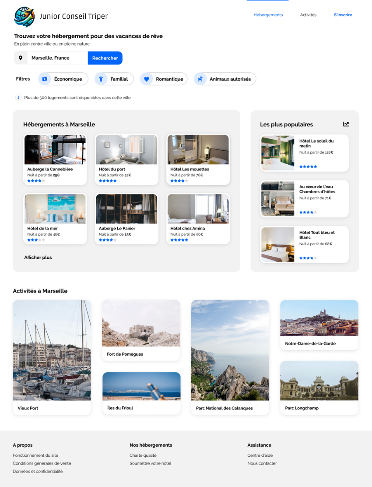
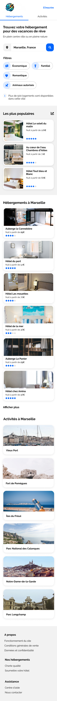

# Junior Conseil Triper ✈️

Bienvenue à la Taker Academy !

Il est temps de démarrer votre apprentissage du web !

Et pour ce faire, quoi de mieux que de commencer par un projet emblématique du web : la recréation de maquette !

## Objectif du projet 🎯

- Comprendre les bases de l'HTML et du CSS
- Comprendre les principes de base du responsive design
- Comprendre les principes de base du SEO et de la sémantique

## Instructions 📚

Voilà le topo :

Junior Conseil Triper a racheté Reservia et a malheureusement perdu l'intégralité de la base de code !

Vous allez devoir recréer from scratch en ``HTML/CSS`` cette maquette :

Bien évidemment, le site doit être responsive. Voici la maquette mobile :

Mais si ce n'était que ça, Junior Conseil Triper ne se démarquerait jamais de ses concurrents. Pour ce faire, vous allez ajouter un peu de peps à votre page !

## Contraintes techniques 🛠️

- Cliquer sur la section "Activité" dans la navbar vous amènera vers une ancre interne du même nom.
- Survolez les différentes cartes du site les fera s'animer d'une manière laissée à votre discrétion mais qui doit être cohérente.

Vous devrez rendre votre code HTML au sein d'un seul et même fichier : `index.html` et votre code CSS également dans un seul et même fichier : `style.css`.

La validation du projet se concentrera sur la fidélité de votre reproduction vis-à-vis de la maquette. Tout bonus est bon à prendre :)

> **``Attention``** Votre code HTML et CSS doivent être propres et dépourvus de toute erreur ou avertissement W3C \
cf : [Validator W3](https://validator.w3.org/)

Vous devez également utiliser correctement les principes de balises sémantiques propres à l'HTML.

## Ressources 📚

- [HTML & CSS - Les bases du positionnement](https://openclassrooms.com/fr/courses/1603881-creez-votre-site-web-avec-html5-et-css3)
- [Balises sémantiques HTML](https://developer.mozilla.org/fr/docs/Glossaire/S%C3%A9mantique#balise_s%C3%A9mantique)
- [Validator W3](https://validator.w3.org/)
- [Principes de base de l'accessibilité](https://www.w3.org/WAI/fundamentals/accessibility-intro/)
- [Principes de base du responsive design](https://www.alsacreations.com/article/lire/930-introduction-au-responsive-web-design.html)
- [Font Awesome](https://fontawesome.com/)
- [Github Pages](https://pages.github.com/)

## Les livrables attendus 📦

- Votre code HTML et CSS
- Un lien vers votre page web hébergée en ligne sur GitHub Pages

## Deadline ⏳

Vous avez jusqu'au **11 Février 2024**, 23h42 pour rendre votre projet.

## Bon courage et bon code ! 💪
